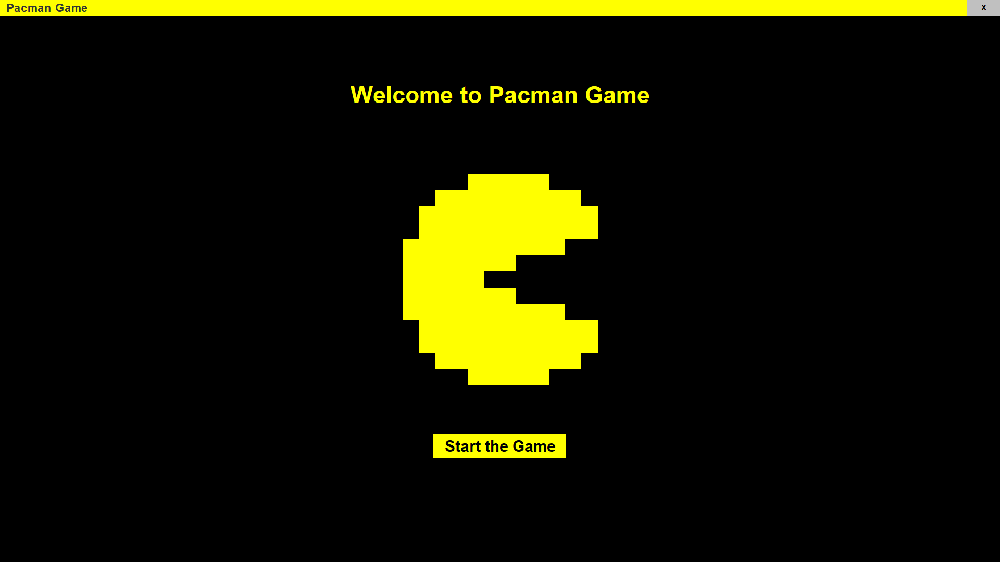
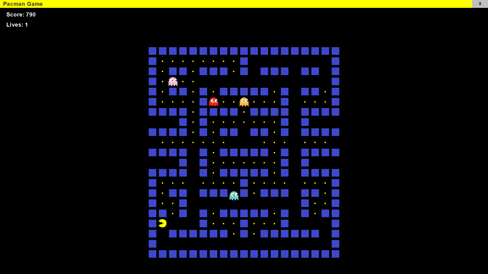
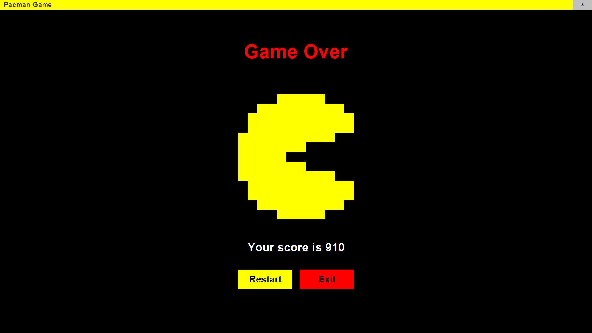

# 🎮 Pacman Game in Java

Welcome to the **Pacman Game in Java**, a fully functional Pac-Man clone built using **Java** and **Java Swing**. This project follows a structured approach with routing, state management, and a dynamic game environment.

## 📚 Introduction

This game brings the classic Pac-Man experience to life with smooth controls and a well-structured architecture. Users can navigate Pac-Man through a maze while avoiding ghosts and collecting points.

## ✨ Features

- **Full Pac-Man Game** implemented using Java and Java Swing.
- **AppRouter** to manage page navigation and state transfer.
- **GameData** class to distribute data using a **Consumer-Listener model**.
- **Modular Architecture** with separate classes for `Block`, `GameMap`, etc.
- **Smooth Player Controls** using arrow keys.
- **Multiple Pages**:
  - Welcome Page
  - Game Page (Main Pac-Man Game)
  - Game Over Page
  - Settings Page (WIP)
  - Profile Page (WIP)

## ⚙️ Game Controls

| Key | Action     |
| --- | ---------- |
| ⬆️  | Move Up    |
| ⬇️  | Move Down  |
| ⬅️  | Move Left  |
| ➡️  | Move Right |

## 🔮 Upcoming Features

- **Optimized Routing System** for better state management.
- **Profile System** to save and display player information.
- **Sound System** to enhance gameplay experience.
- **Settings Page** for customizing game preferences.
- **Unique Ghost Movement AI** to make the game more challenging.

## 🧠 What I Have Learned

- Implementing a **Consumer-Listener model** for state management.
- Building a **routing system** in Java for page navigation.
- Creating an interactive **game environment using Java Swing**.
- Structuring a project for **scalability and maintainability**.

## 🖼️ Demo Image

**Welcome Page**

<br />

**Main Game Page**


**Game Over Page**


## 🛠️ Project Installation

1. Ensure that Java **JDK** is installed on your system. If not, download and install it from the official **[Java website](https://www.oracle.com/java/technologies/downloads/)**.

2. Clone the repository:
   ```bash
   git clone https://github.com/pacman.git
   ```
3. Navigate to the project folder:
   ```bash
   cd pacman
   ```
4. Compile and run the project:
   ```bash
   javac .\src\App.java && java App
   ```

## Author Information

## ✨ Sahedul Islam Rony

**`Student/Programmer`**

I am a Computer Science and Engineering (CSE) undergraduate at [**Jashore University of Science and Technology**](https://just.edu.bd) having a strong passion for exploring cutting-edge technologies and constantly seek opportunities to learn, innovate, and push the boundaries of what’s possible.

## About This Project

The **Pacman Game** in **Java** is a fully functional recreation of the classic **Pac-Man** arcade game, built using **Java** and **Java Swing**. This project showcases my ability to implement structured game development concepts, including **page routing**, **state management**, and **object-oriented programming**. The game features smooth player controls, multiple pages, and a modular architecture that ensures scalability and maintainability.

## Contact

For any inquiries or feedback regarding this project, feel free to reach out to me:

- **Email:** **cast.sahedul@gmail.com**
- **LinkedIn:** [**@sahedulislamrony**](https://www.linkedin.com/in/sahedulislamrony/)
  <br/>

## 🙌 Acknowledgements

A huge thanks to [**Kenny Yip Coding**](https://www.youtube.com/@KennyYipCoding) for providing insightful tutorials on game development logic, which greatly helped in understanding the basics of Pac-Man mechanics.
<br/>

---
